<div align="center">


# Glamour Games

**10 glitzernde Spiele in einer App – für Spieleabende auf dem Sofa, am Küchentisch oder unterwegs.**

Kein Werbebanner. Keine Käufe. Kein Konto. Kein Internet nötig. Einfach spielen.

[](https://github.com/domezos2024/glamour_games/releases/latest)
[](https://github.com/domezos2024/glamour_games/releases/latest/download/GlamourGames-1.8.1.apk)
[](#installation)
[](https://github.com/domezos2024/glamour_games_windows)
[](#technik)
[](LICENSE)

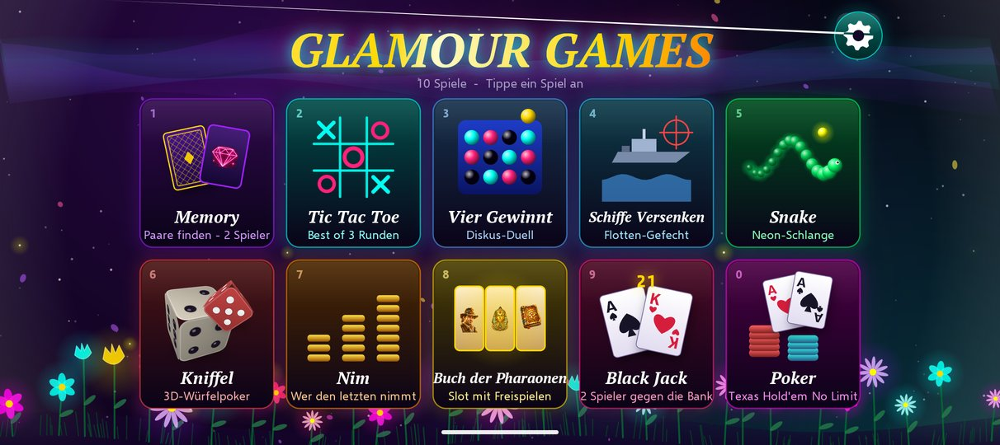

</div>

> **Auch für Windows:** Die gleiche Spielesammlung gibt es für den PC – **[Glamour Games für Windows](https://github.com/domezos2024/glamour_games_windows)** (Download als ZIP, keine Installation nötig).

---

## Was ist Glamour Games?

Glamour Games ist eine Spielesammlung für Android im Neon-Glamour-Look: leuchtende Kacheln, Glow- und Bloom-Effekte, Partikel-Feuerwerk, 3D-Würfel und eine Blumenwiese, die im Hintergrund lebt. Die meisten Spiele sind für **zwei Personen an einem Gerät** gemacht – ideal für Eltern und Kinder, Paare oder Freunde. Snake, der Slot und Poker gegen den Computer sind auch allein spielbar.

Die App ist die Android-Umsetzung der gleichnamigen [Windows-Version](https://github.com/domezos2024/glamour_games_windows). Spielregeln, Grafiken und Animationen entsprechen dem Original; angepasst wurde nur, was Touch-Bedienung und Android erfordern.

## Die 10 Spiele

| | Spiel | Worum es geht |
| :-: | --- | --- |
| 1 | **Memory** | 20 Kartenpaare, zwei Spieler decken abwechselnd auf – wer die meisten Paare findet, gewinnt. Mit Highscore-Liste. |
| 2 | **Tic Tac Toe** | Klassiker im Neon-Gitter, gespielt als *Best of 3*. |
| 3 | **Vier Gewinnt** | Leuchtende Spielsteine fallen in das Raster – vier in einer Reihe gewinnen. |
| 4 | **Schiffe Versenken** | Flotte platzieren, Gerät übergeben, gegenseitig beschießen. Die gegnerische Flotte bleibt immer verdeckt. |
| 5 | **Snake** | Neon-Schlange per Wischgeste oder Steuerkreuz, mit steigendem Tempo und gespeichertem Bestwert. |
| 6 | **Kniffel** | 3D-Würfel, Halten, zweimal Nachwürfeln, vollständiger Block mit Bonus – für zwei Spieler. |
| 7 | **Nim** | Drei Stapel Goldmünzen: Wer den letzten Stab nimmt, gewinnt. Einfach zu lernen, schwer zu meistern. |
| 8 | **Buch der Pharaonen** | Ägypten-Slot mit 5 Walzen, bis zu 10 Gewinnlinien, Freispielen mit Sondersymbol, Autoplay und Risiko-Leiter. Nur Spielgeld. |
| 9 | **Black Jack** | Zwei Spieler gegen die Bank: Einsatz wählen, Karte, Halten oder Verdoppeln. Blackjack zahlt 3 : 2. |
| 0 | **Poker** | Texas Hold'em No Limit mit zwei Spielern und einem Computer-Gegner, steigenden Blinds und Verlaufsprotokoll. |

<div align="center">
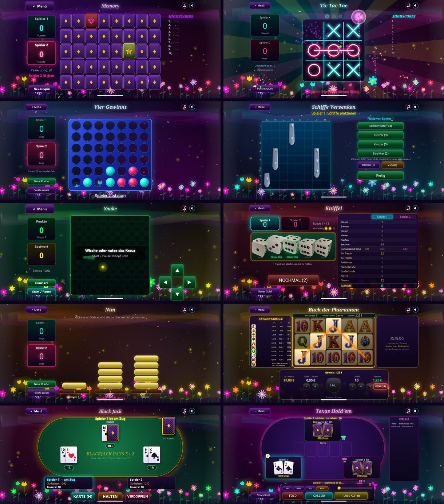
</div>

<details>
<summary><b>Einzelne Screenshots anzeigen</b></summary>

| | |
| :-: | :-: |
| 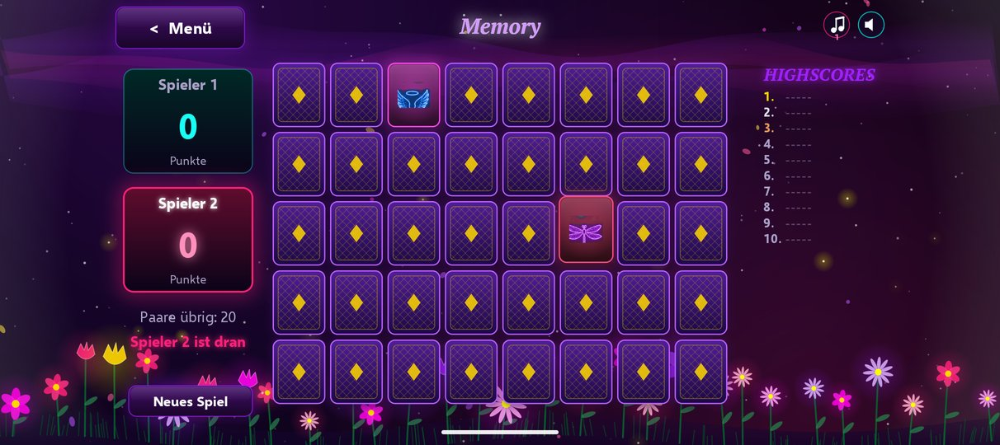 Memory | 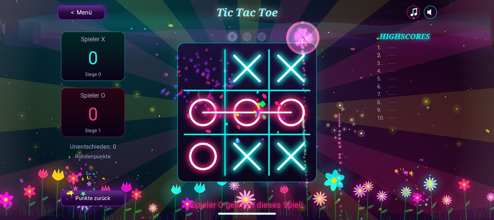 Tic Tac Toe |
| 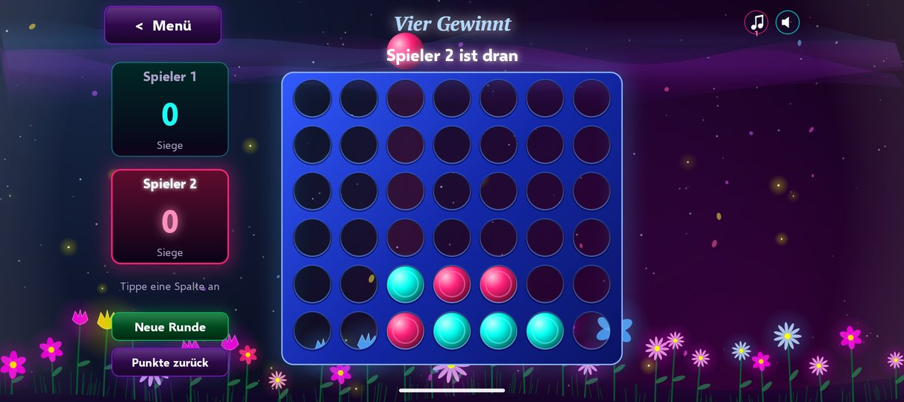 Vier Gewinnt | 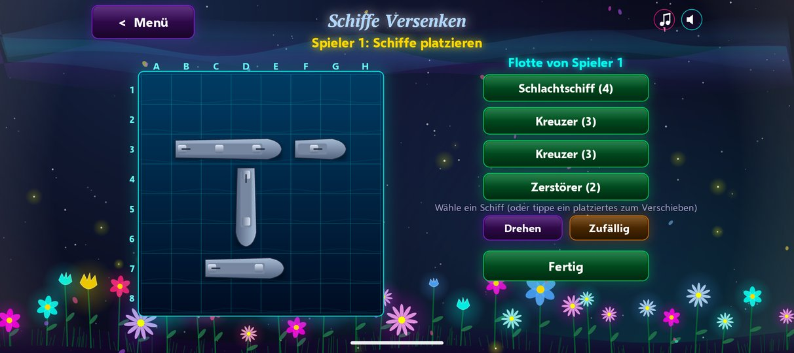 Schiffe Versenken |
| 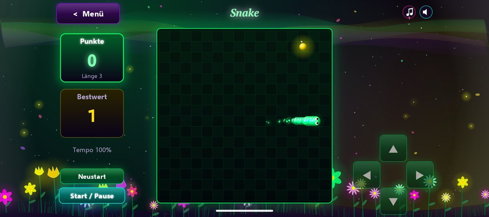 Snake | 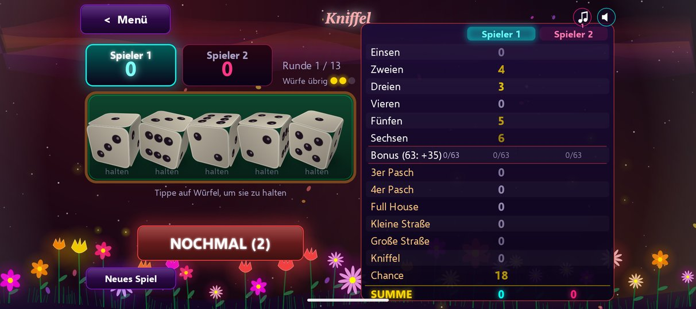 Kniffel |
| 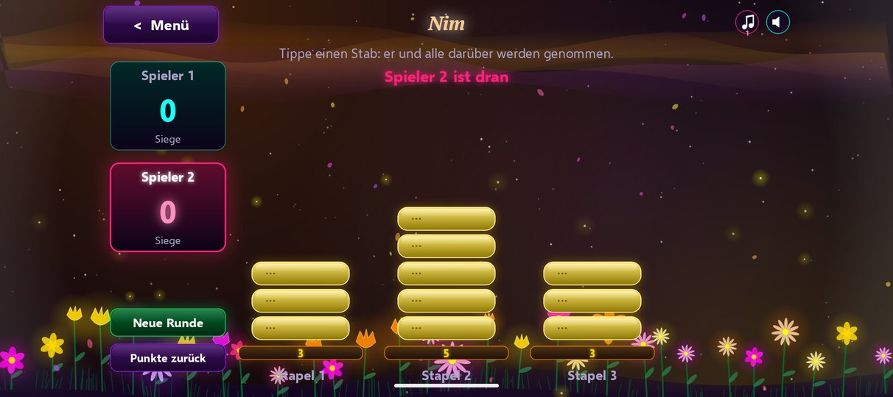 Nim | 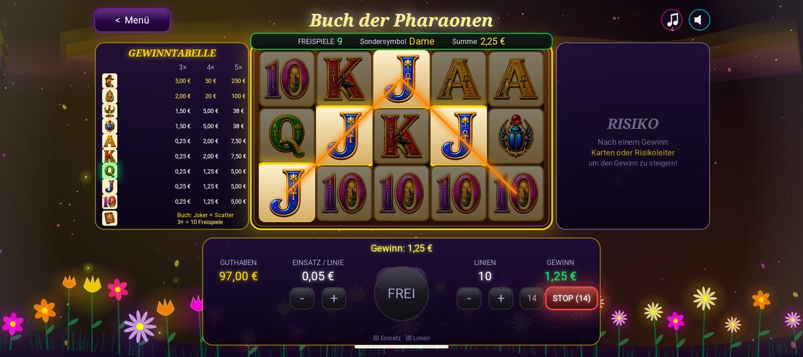 Buch der Pharaonen |
| 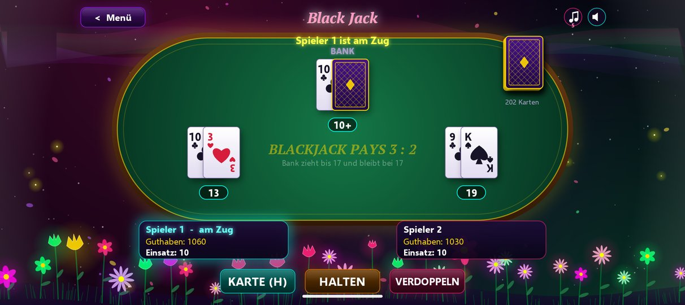 Black Jack | 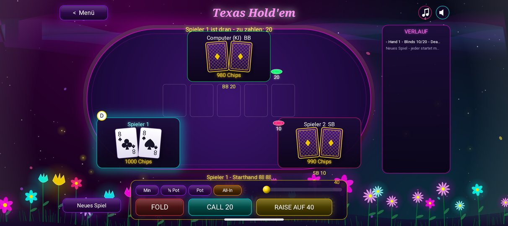 Poker |
| 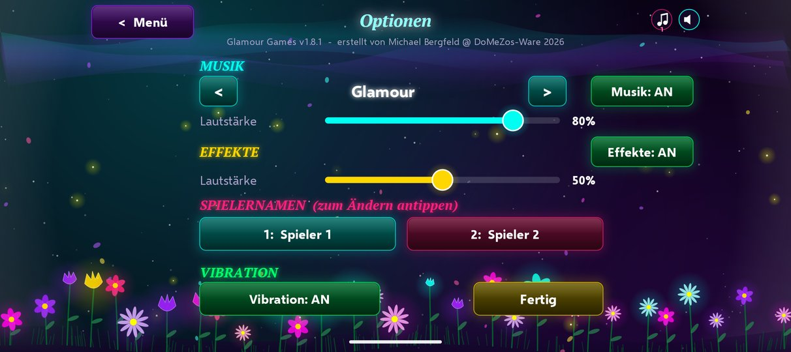 Optionen | |

</details>

## Wer fängt an? Der Münzwurf

Jedes neue Zwei-Spieler-Spiel beginnt mit einem animierten Münzwurf: Spieler 1 wählt Kopf oder Zahl, die Münze wirbelt durch die Luft – und wer richtig liegt, darf anfangen. In den Folgerunden wechselt der Startspieler automatisch ab.

<div align="center">
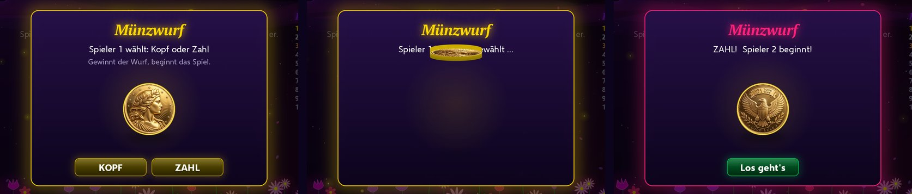
</div>

## Das steckt drin

- **Münzwurf** entscheidet bei jedem neuen Zwei-Spieler-Spiel, wer beginnt – danach wechselt der Startspieler fair ab.
- **Sieger-Feier** mit Banner, Feuerwerk und einer Parade aus Würfeln, Spielsteinen oder Matrosen.
- **Eigene Spielernamen**, die in allen Spielen erscheinen.
- **Prozedurale Musik** mit mehreren Stücken und eigenen Soundeffekten – Lautstärke getrennt regelbar.
- **Vibration** bei Treffern und Aktionen (abschaltbar).
- **Spielstände und Bestwerte** bleiben nach dem Beenden erhalten.
- **Flüssig**: bis zu 120 FPS auf aktuellen Geräten dank GPU-Rendering.
- **Kinderfreundlich**: keine Werbung, keine In-App-Käufe, keine Datensammlung, keine Berechtigungen außer Vibration.

## Installation

1. Auf dem Android-Gerät die neueste **[GlamourGames-1.8.1.apk](https://github.com/domezos2024/glamour_games/releases/latest)** herunterladen.
2. Datei antippen. Beim ersten Mal fragt Android, ob Installationen aus dieser Quelle erlaubt sind – zulassen.
3. Glamour Games starten und los geht's.

Alternativ am PC per USB-Debugging:

```bash
adb install -r GlamourGames-1.8.1.apk
```

**Voraussetzungen:** Android 10 (API 29) oder neuer, Querformat. Getestet auf Google Pixel 10 (Android 17) und im Android-Emulator.

> **Updates:** Neue Versionen lassen sich einfach über die alte installieren, Spielstände bleiben erhalten. Alle Release-APKs sind mit demselben Schlüssel signiert (SHA-256 des Zertifikats: `94:36:9E:3F:94:D8:D3:8D:86:A1:D2:53:DB:F4:50:F0:9F:85:C9:A3:F9:4D:06:43:38:C5:70:45:EB:7E:85:81`).

## Bedienung

| Aktion | So geht's |
| --- | --- |
| Spiel starten | Kachel im Menü antippen |
| Optionen | Zahnrad oben rechts im Menü |
| Zurück zum Menü | Android-Zurück-Geste oder Knopf „Menü" |
| Musik / Effekte schnell stummschalten | Symbole oben rechts in jedem Spiel |
| Gerät weitergeben | Bei verdeckten Spielen (Schiffe Versenken, Poker) erscheint ein Übergabe-Bildschirm |

## Technik

Glamour Games ist **kein** Unity- oder Unreal-Spiel, sondern eine eigene, schlanke C#-Engine:

- **.NET 10 for Android** (`net10.0-android`, Target API 36, Min API 29)
- **SkiaSharp 4** mit `SKGLSurfaceView` für GPU-beschleunigtes 2D-Rendering
- Virtueller Designraum **1600 × 900** mit Letterbox-Skalierung auf jedes Seitenverhältnis
- Eigene Systeme für Szenen, UI, Animation/Easing, Partikel, Bloom/Glow, 3D-Würfel und Münzwurf
- Audio über `AudioTrack` – Musik und Effekte werden zur Laufzeit synthetisiert
- Touch-Eingaben werden per Queue auf den Render-Thread übergeben

```
AndroidApp/
├── MainActivity.cs      Android-Host, Vollbild, Back-Handling, Tastatur
├── GLGameView.cs        GPU-Renderpfad (Standard)
├── GameView.cs          CPU-Fallback (Intent-Extra renderer=canvas)
├── Core/                Engine: App, Scene, Ui, Gfx, Anim, Particles, Bloom, Sfx, Save, ...
├── Games/               Menü, Optionen und die 10 Spiele
└── Assets/              Grafiken und eingebettete Schriften
```

### Selbst bauen

Voraussetzungen: .NET SDK 10 mit Android-Workload (`dotnet workload install android`) und Android SDK Platform 36.

```bash
git clone https://github.com/domezos2024/glamour_games.git
cd glamour_games/AndroidApp

# Debug-Build auf angeschlossenes Gerät
dotnet build -t:Run -f net10.0-android

# Release-APK
dotnet publish -c Release -f net10.0-android -p:AndroidPackageFormats=apk
```

Ohne eigenen Signaturschlüssel wird der Release-Build mit dem Debug-Schlüssel signiert. Die Release-Signierung wird nur aktiv, wenn `signing/glamourgames-upload.keystore` existiert (siehe `GlamourGames.Android.csproj`).

Für Tests lässt sich jedes Spiel direkt starten (N = 0 … 9):

```bash
adb shell am start -n com.glamourgames.android/crc64f5bd65762c13e41b.MainActivity --ei game N
```

Weitere Details: [Portierungsleitfaden](docs/PORTING_GUIDE.md) · [Implementierungsstatus](docs/IMPLEMENTATION_STATUS.md) · [Changelog](CHANGELOG.md)

## Mitmachen

Fehler gefunden oder eine Idee für ein elftes Spiel? Einfach ein [Issue eröffnen](https://github.com/domezos2024/glamour_games/issues/new/choose). Pull Requests sind willkommen – bitte vorher kurz im Issue abstimmen, damit Stil und Look einheitlich bleiben.

## Lizenz

Quellcode unter der [MIT-Lizenz](LICENSE). Mitgelieferte Schriften und Bibliotheken: siehe [Third-Party Notices](THIRD_PARTY_NOTICES.md).

<div align="center">
<br>
<b>Glamour Games 1.8.1</b> – erstellt von Michael Bergfeld @ DoMeZos-Ware 2026
<br>
<a href="https://github.com/domezos2024/glamour_games">Android-Version</a> · <a href="https://github.com/domezos2024/glamour_games_windows">Windows-Version</a>
</div>
